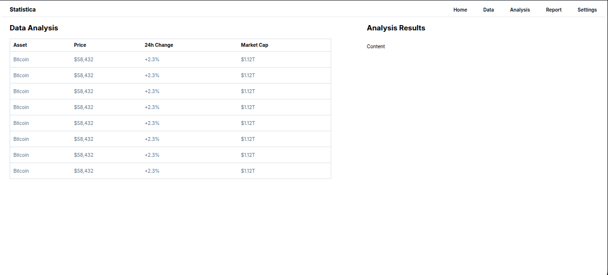
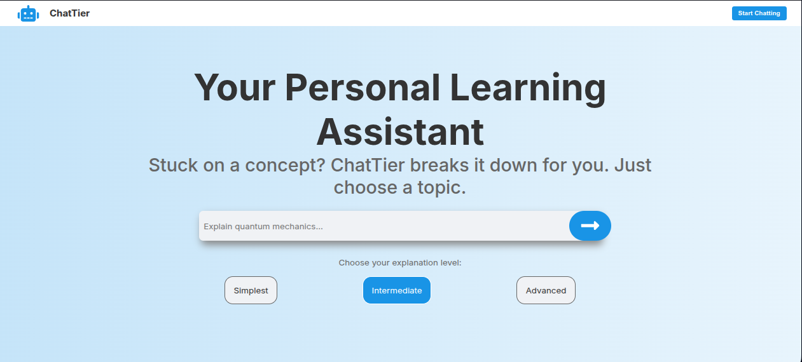

# Front-End Playground  

This repository is a collection of front-end projects I’ve built while practicing HTML, CSS, and JavaScript.  
Each project lives in its own folder and can be opened directly in the browser.  

---

You can find screenshots of the projects inside the `docs/` folder.  
Here are a few examples:

  
  
